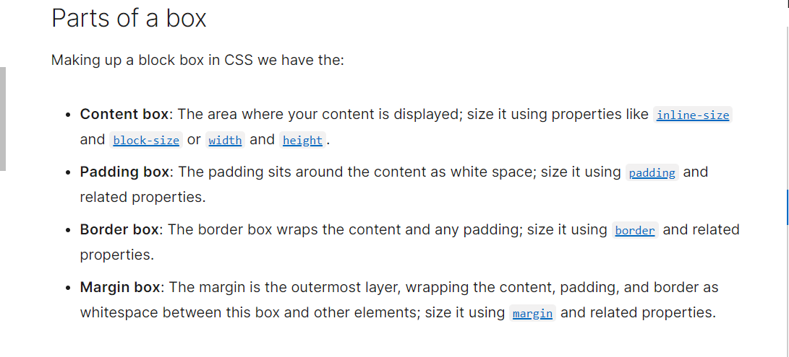
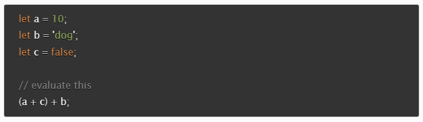

# HTML Lists, JavaScript Control Flow, and the CSS Box Model

There are three different skill sets that we are learning all at ONE time. Three different skills being taught all at once means there will be a ton of information coming our way. Knowing how each one interracts with each other is important and can be a source of frustration for beginners. I am still trying to get comfortable with how JavaScript syntax is put together but also why it is structured the way it is. I feel like that is something I will need to do outside of class and class work so having these reference documents readily on-hand is huge for me.

## Learn HTML
#### [Ordered](https://developer.mozilla.org/en-US/docs/Web/HTML/Element/ol) and [Unordered Lists](https://developer.mozilla.org/en-US/docs/Web/HTML/Element/ul)
1. When should you use an `unordered list` ( `<ul>` ) in your HTML document?
- Use it when grouping a collection of items that do not have a numerical ordering, and their order in said list is meaningless.
- Unordered lists are usually displayed with a bullet which can take on several forms such as a dot, a circle, or a square.
- The bullet styling is not defined in the actual HTML description of the page, but in its associated CSS, using the `list-style-type` property.

2. How do you change the `bullet style` of unordered list items?
- As mentioned above, bullet styling is defined by its associated CSS.
- This is done using the `list-style-type` property.

3. When should you use an `ordered list` vs an `unordered list` in your HTML document?
- A developer should use an `ordered list` element ( `<ol>` ) if the order of said list is meaningful.
  * Steps in a recipe
  * Turn-by-turn directions

4. Describe two ways you can change the numbers on `list items` provided by an `ordered list`?
- This can be done by applying *global attributes*
  I. `reversed` - this Boolean attribute specifies that the list items are in reverse order and items will be numbered from high to low.

  II. `type` will affect how the list is numbered.
  * `a` for lowercase letters.
  * `A` for uppercase letters.
  * `i` for lowercase Roman numerals.
  * `I` for uppercase Roman numerals.
  * `1` for numbers ( default ).

## Learn CSS
#### [The Box Model](https://developer.mozilla.org/en-US/docs/Learn/CSS/Building_blocks/The_box_model)
1. Describe the CSS properties of `margin` and `padding` as characters in a story. What is their role in a story titled: “The Box Model”?
**The Box Model**:
In the kingdom of Boxy, ruled by Boximus Maximus, there sat a great big castle. Boximus was not a man for the people and he wanted as much space between himself and them as possible. He called upon his contractor, Marginally Okay Mephisto, to build him a moat around the castle so that no subjects could enter. 
King Boximus also wanted as much cushion between the moat and his castle walls so he called upon his trusted landscaper, Paddington Paddleboat, to fill up as much space between the castle and the inner border of the moat. Hundreds of trees and thousands of bushes were brought in and when all was said and done, there was only about 3px between the shrubbery and the castle wall.
The end.

2. List and describe the **four** parts of an HTML elements box as referred to by the `box model`.

*Credit: [MDN Web Docs](https://developer.mozilla.org/en-US/docs/Learn/CSS/Building_blocks/The_box_model)

## Learn JavaScript
#### [Arrays](https://developer.mozilla.org/en-US/docs/Learn/JavaScript/First_steps/Arrays), [Operators & Expressions](https://developer.mozilla.org/en-US/docs/Web/JavaScript/Guide/Expressions_and_Operators), [Conditionals](https://developer.mozilla.org/en-US/docs/Learn/JavaScript/Building_blocks/conditionals), and [Loops](https://developer.mozilla.org/en-US/docs/Learn/JavaScript/Building_blocks/Looping_code)

1. What `data types` can you store inside of an `Array`?
- Strings
- Numbers
- Objects
- Other arrays

2. Is the `people` array a valid JavaScript array? If so, how can I access the values stored? If not, why?
- Yes, arrays can have mixed data *types*. Developers do not have to limit themselves to storing just numbers in one array and then storing only strings in another.
- To access the values of this string:
  * console.log(people);

3. List five shorthand operators for assignment in javascript and describe what they do.
- **Addition** assignment: x += f( ) which is equivalent to  x = x  f( ). This adds the value on the right to the variable's current value and assigns the result to the variable.
- **Subtraction** assignment:  x -= f( ) which is equivalent to x = x - f( ). This subtracts the value on the right from the variable's current value and assigns the result to that variable.
- **Multiplication** assignment: x *= f( ) which is equivalent to x = x * f( ). Multiplies the variables current value by the value on the right and assigns the result to the variable.
- **Division** assignment: x /= f( ) which is equivalent to x = x / f( ). Divides the variable's current value by the value on the right and assigns the result to the variable.
- **Remainder** assignment: x %= f( ) which is equivalent to x = x % f( ). Divides the variable's current value by the value on the right and assigns the *remainder* to the variable.

**Credit**: ChatGPT. "Show me shorthand examples and explanations for each of these assignment operators: Addition, Subtraction, Multiplication, Division and Remainder." OpenAI, 2024. https://openai.com/chatgpt/.

4. Read the code below and evaluate the last expression and explain what the result would be and why.

- (10 + false) + dog
- 10 + false essentially equates to: 10 + 0 [this is because the computer reads 10 + Boolean, which converts to 10 + 0, resulting in just the number 10]
- Now the expression is 10 + dog. Adding a number (10) to a string (dog); the computer concactenates them and the result is: 10dog. The number 10 gets turned into a string.

5. Describe a real world example of when a conditional statement should be used in a JavaScript program.
- I had recently looked into building my own PC and there are several websites that will help with picking out the right components. The user enters which parts of the PC they would like to assemble and the website will show whether or not all the pieces will work together. 
- It checks to make sure that you are not tyring to buy and use incompatible equipment.

6. Give an example of when a `Loop` is useful in JavaScript.
- When adding up all the numbers listed in an array.
- A developer would have the for loop iterate over each element in an array with *numbers*, adding each one to the next until there are no more numbers to add and that is when the *sum* is calculated.

### Things I Want to Know More About
- 