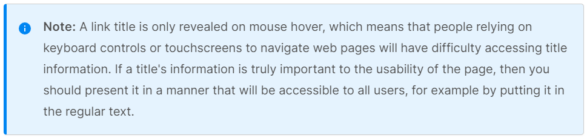
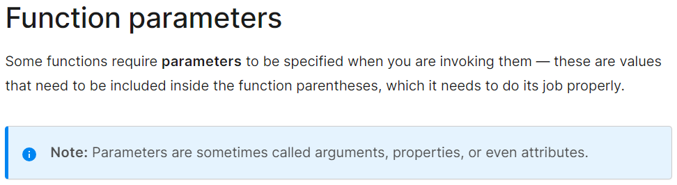

# HTML Links. JavaScript Functions. Intro to CSS Layout

I was excited to read "6 Reasons for Pair Programming". I have been surprised with how willing everyone in class, and the industry as a whole from what little I've seen, has been to collaborate with one another. We are all coming in with different backgrounds/skillsets and I am experiencing, firsthand, how beneficial open and judgement-free collaboration is. If this is what most of the software development industry is striving for, then I know that I chose a great field to work and grow in. 

## Learn HTML
[Creating Hyperlinks](https://developer.mozilla.org/en-US/docs/Learn/HTML/Introduction_to_HTML/Creating_hyperlinks)
#### 1. To create a basic link, we wrap text or other content inside what element?
 - A developer would use the `< a >` element.

#### 2. The `href` attribute contains what information?
- This is the **Hypertext Reference**, or **target**, which contains the web address.

#### 3. What are some ways we can ensure links on our pages are accessible to all readers?

* Credit: [MDN Web Docs](https://developer.mozilla.org/en-US/docs/Learn/HTML/Introduction_to_HTML/Creating_hyperlinks)

## CSS Layout
[Normal Flow](https://developer.mozilla.org/en-US/docs/Learn/CSS/CSS_layout/Normal_Flow) and [Positioning](https://developer.mozilla.org/en-US/docs/Learn/CSS/CSS_layout/Positioning)
#### 1. What is meant by “normal flow”?
- This is the default way that webpage elements lay themselves out if a developer has not changed the layout.

#### 2. What are a few differences between `block-level` and `inline` elements?
- Block level: a block-level element's content fill all available inline space of its parent element, "growing along the block dimension to accommodate its content.", as per [MDN Web Docs](https://developer.mozilla.org/en-US/docs/Learn/CSS/CSS_layout/Normal_Flow)
- Inline level: the size of an inline-level element is only the size of its content.

#### 3. ___ positioning is the default for every html element.
- "Box model"

#### 4. Name a few advantages to using absolute positioning on an element.
- It means that a developer can create separate and isolated user interface (UI) features and they won't interfere with the layout of other elements on the page. 
- UI features such as:
  * Pop-up info boxes
  * Control menus
  * Rollover panels
  * UI features which can be dragged and dropped anywhere on said page.

#### 5. What is a key difference between fixed positioning and absolute positioning?
- Fixed positioning works exactly the same way as Absolute positioning except that: it *usually* fixes an element in place relative to the visible portion of the viewport.
- By using **fixed positioning*, developers can create helpful UI items which are fixed in place, like navigation bars that stay visible even as the user scrolls through the web page.

## Learn JS
[Functions: Reusable Blocks of Code](https://developer.mozilla.org/en-US/docs/Learn/JavaScript/Building_blocks/Functions)
#### 1. Describe the difference between a function declaration and a function invocation.
- A function invocation is calling a function that has already been declared.

#### 2. What is the difference between a parameter and an argument?
- As per [MDN Web Docs](https://developer.mozilla.org/en-US/docs/Learn/JavaScript/Building_blocks/Functions#function_parameters): see image below.

## Miscellaneous
[6 Reasons for Pair Programming]()
#### 1. Pick 2 benefits to pair programming and reflect on how these benefits could help you on your coding journey.
- Learning from fellow students:
  * I have always enjoyed working in teams/pairs. I have always worked best with others who are freely willing to share their knowledge amongst their peers. In this class alone, I don't think I could have submitted my last lab without my classmates' help. Also, teaching other people about new concepts/ideas is a great way for a developer to practice their mentoring skills. This industry can be intimidating to someone like myself who has little-to-no experience in tech. Having strong mentors with great collaboration skill will be huge in continuing to recruit people into this field. I would love to get enough experience in this field so that when the time comes, I can teach this to people who are in my position now.

- Job Interview Readiness:
  * A friend of mine who is actually a software developer now started his tech journey at a startup company working a recruiter. He said that he was lucky and was able to get some inside knowledge of how the whole job interview process goes for someone in the tech industry. It was also in that position that he learned the importance of keeping a professional appearance on his LinkedIn page (and all other social media accouts). Even with the inside knowledge, he said that is can be a tough industry to break into but with proper guidance and practice, a developer can be more than well prepared for when that time comes. It was honestly one of the biggest reasons that I chose Code Fellows and I need to keep that in mind when working on the coaching assignments.

## Things I Want to Know More About
- When I have my Coaching Career meeting on Friday, I want to specifically ask about how his collaboration experience has been while working in the industry. 