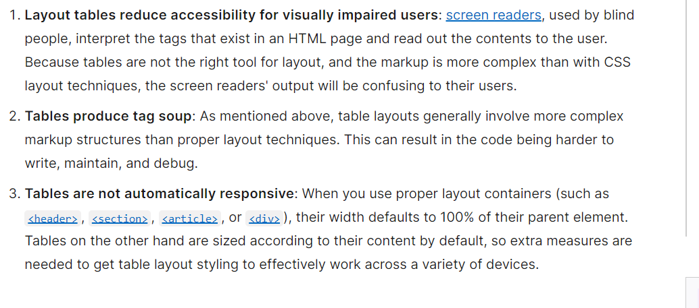

# Object-Oriented Programming HTML Tables
#### [Domain Modeling](https://github.com/codefellows/domain_modeling#domain-modeling)
1. Explain why we need domain modeling.
- A well put together, crafted, and articulated domain model can help developers understand what features and functions their software needs to have.
- Domain modeling helps "clarify requirements, reduces misunderstandings, and ensures a final product meets the needs to its users effectively." - Credit: [ChatGPT](https://chat.openai.com/share/5564a0b6-7920-4aad-9e8e-bd20b1f3e4c1)

#### [HTML Table Basics](https://developer.mozilla.org/en-US/docs/Learn/HTML/Tables/Basics)
1. Why should tables not be used for page layouts?
[MDN Web Docs](https://developer.mozilla.org/en-US/docs/Learn/HTML/Tables/Basics#what_is_a_table) explains this by stating:

2. List and describe 3 different semantic HTML elements used in an HTML `<table>`.
- `<th>`: this element defines a cell as the header of a group of table cells and may be used as a child of the `<tr>` element.
- `<table>`: this represents **tabular** data - information presented in a two-dimensional table made up of rows and columns containing data.
- `<tr>`: this element defines a row of cells in a table. That row's cell can then be established using a mix of `<td>` (a data cell) and `<th>` (a header cell) elements.

#### [Introducing Constructors](https://developer.mozilla.org/en-US/docs/Learn/JavaScript/Objects/Basics#introducing_constructors)
1. What is a constructor and what are some advantages to using it?
- A **constructor** is just a function that is called by using the `new` keyword.
- It allows developers to create more than one object from just a single object definition.

2. How does the term `this` differ when used in an object literal versus when used in a constructor?
- In an object literal, `this` refers to the object that contains it.
- In a constructor function, `this` refers to the instance of the object that is created by the constructor when it's invoked wiht the `new` keyword.
- Credit[ChatGPT.com](https://chat.openai.com/share/938d784d-b733-406a-b5b6-c17d3d030f1c)

#### [Object Prototypes Using a Constructor](https://ui.dev/beginners-guide-to-javascript-prototype)
1. Explain prototypes and inheritance via an analogy from your previous work experience.
(*Note*: This is a very common front end developer interview question.)
- We had to pour concrete from time to time when I worked construction. We didn't do it everyday but we did it enough that my foreman ended up making a table in Excel that had the width, length, and depth of each hole that needed done. he would also write in how many feet of form boards we woulde need, approximatley how many pieces of rebar we would need, and whether or not we could pour it by hand or if we needed to call a cement truck.
- The Excel spreadsheet was just him putting in all of this information in for each location. It wasn't as if he was plugging these numbers in and then the spreadsheet was doing the math for him. He would type in the numbers, do the math, then write down the answer in the corresponding cell.
- The table he drew up though could easily be turned into a functioning table where the user only has to type in the raw data and then have the resulting information calculated and displayed. He essentially created a nice prototype of the table. Someone could take that prototype and use it as the basis for creating an actual dynamic spreadsheet.

## Things I Want to Know More About
[HTML Table Advanced Features and Accessibility](https://developer.mozilla.org/en-US/docs/Learn/HTML/Tables/Advanced)