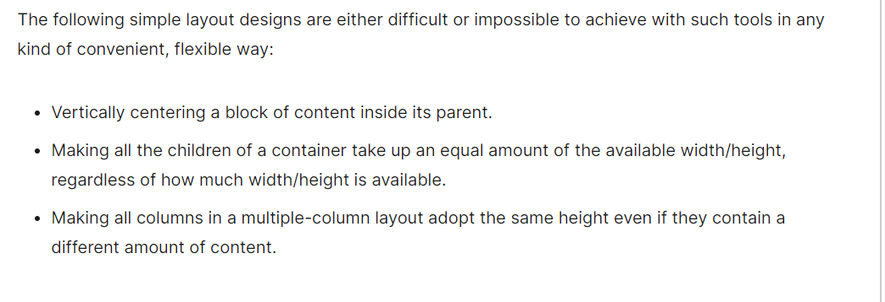

# CSS Layout

#### Learn CSS: [Flexbox](https://web.dev/learn/css/flexbox/)

1. Flexbox is designed for one-dimensional content. Explain what this means.
- It excels at taking a bunch of items that have varrying sizes and rendering the best layout for those items.
- Flexbox is the ideal layout pattern/model for a sidebar. Flexbox helps lay the sidebar and its content out inline but where there's not enough space remaining, the sidebar will break onto a new line.

2. Explain the difference between the main axis and cross axis.
- Main axis: this axis is set by the developer's `flex-direction` property. 
  * If that happens to be `row`, then the  main axis is along the row.
  * If it is `column`, then the main axis will be along the column.

- Cross axis: this axis runs in the other direction relative to the main axis.
  * So, if `flex-direction` is `row`, then the cross axis runs along the column.

3. How can using certain properties of flexbox negatively impact accessibility?
- `row-reverse` and `column-reverse` values can negatively impact accessibility. This is because the reordering happens only for the *visual* order, **not** the *logical* order.
  * The logical order is the order in which a screen reader will read out the content.

#### [CSS Layout: Flexbox](https://developer.mozilla.org/en-US/docs/Learn/CSS/CSS_layout/Flexbox)
1. What are some advantages of using flexbox over float?
- Without the Flexbox layout, the following examples would either be to difficult or impossible to achieve with features such as *float* and *positioning*.
 * Credit: [MDN Web Docs](https://developer.mozilla.org/en-US/docs/Learn/CSS/CSS_layout/Flexbox)

2. How does this topic connect with your long term goals?
- I really enjoyed the Partner Power Hour last Friday and keeping accessibility in mind when designing anything. Flexbox allows us developers to do some very cool things with layouts. I will just need to be mindful about when and where it is implemented. 

## Things I Want to Know More About
- Is there a way to use `row-reverse` or `column-reverse` so that it won't negatively impact accessibility issues?
- Learn CSS: [Layout](https://web.dev/learn/css/layout/)