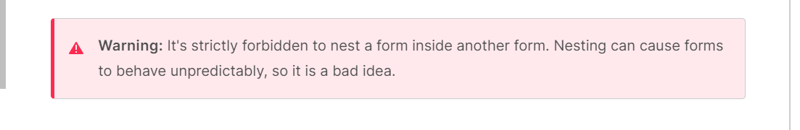

# Forms and JavaScript Events

### [HTML Forms](https://developer.mozilla.org/en-US/docs/Learn/Forms)
[Your First Web Form](https://developer.mozilla.org/en-US/docs/Learn/Forms/Your_first_form)
[How to Structure a Web Form](https://developer.mozilla.org/en-US/docs/Learn/Forms/How_to_structure_a_web_form)

#### 1. Why are forms so important in web development?
- They are used to collect data from users or allows users to control a user interface.
- Web forms are the main points of interaction between a user and a website and/or application.

#### 2. When designing a form, what are some key things to keep in mind when it comes to user experience?
- Define the right set of data you want to ask your user to enter.
- Where user experience (UX) is concerned; it's important to remember that the bigger your from, the more a developer risks frustrating people and losing users.
- Keep things simple and focused; ask only for the data you *absolutely* need.

#### 3. List 5 form elements and explain their importance.
But first, a reminder from [MDN Web Docs](https://developer.mozilla.org/en-US/docs/Learn/Forms/How_to_structure_a_web_form#the_form_element)

- `<form>` : a document section containing interactive controls for submitting information.
- `<fieldset>` : HTML element used to group several controls as well as labels (`<label>`) withing a web form.
- `<legend>` : this HTML element represents a caption for the content of its parent `<fieldset>`.
- `<label>` : this HTML element represents a caption for an item in a user interface.
- `<select>` : this HTML element represents a control that provides a menu of options to the user.

### [Learn JavaScript](https://developer.mozilla.org/en-US/docs/Learn/JavaScript)
[Introduction to Events](https://developer.mozilla.org/en-US/docs/Learn/JavaScript/Building_blocks/Events)

#### 1. How would you describe events to a non-technical friend?
- Events are something that are triggered or set in motion by the user's actions. Clicking in a certain area will produce a drop-down box from which the user can click to make a selection. 
- The user initiates a specific block of code to run and they don't even know it. All the user is aware of is that they clicked a certain spot on the website and an action resulted from that.

#### 2. When using the `addEventListener()` method, what 2 arguments will you need to provide?
- Event Type: specifies the type of event the developer wants to listen for. 
  * Such as a "click", a "mouseover", a "keydown", etc.
  * It indicates the action that triggers the event listener.

- Even Listener Function: it is the function that should be called when the predetermined event occurs.
  * This defines the action/behavior that should be executed in response to the event.

#### 3. Describe the event object. Why is the target within the event object useful?
- Sometimes, in side an event handler function, a developer will see a prameter specified with a name like `event`, `evt`, or `e`.
- These are called the **event object** and it is automatically passed to event handlers to provide extra features or information.

#### 4. What is the difference between event bubbling and event capturing?
- The key difference is in the direction in which the event propagates through the DOM hierarchy.
  * Bubbling moves the target element up to its ancestors.
  * Capturing moves from the outermost ancetor down to the target element.
Credit [ChatGPT.com](https://chat.openai.com/share/f247a361-3912-4521-a189-e9dc35d50d7f)

## Things I Want to Know More About
[HTML5 Input Types](https://developer.mozilla.org/en-US/docs/Learn/Forms/HTML5_input_types)
[Event Reference and Listings](https://developer.mozilla.org/en-US/docs/Web/Events)
