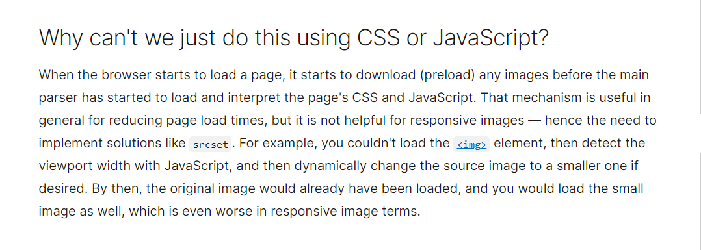

# Audio. Video. Images.
### [Video and Audio Content](https://developer.mozilla.org/en-US/docs/Learn/HTML/Multimedia_and_embedding/Video_and_audio_content)

#### 1. Explain how the ability to use video and audio on the web has evolved since the early 2000s.
- The first influx of videos and audio files online were made availabe and possible by proprietary plugin-based tehcnologies. 
- I.E. Flash and Silverlight
  * Both of these had security and accessibility issues.
  * They have since become obsolete in favor of native HTML solutions `<video>` and `<audio>` elements plus the availability of JavaScript APIs for controlling them.

#### 2. Describe the use of the `src` and `controls` attributes in the `<video>` element.
- `src` (source): this attribute contains a path to the video that the developer wants to embed. It works in exactly the same way as the `` element.
- `controls`: a user must be able to control the video or audio playback; this becomes particularly critical for people who experience epilepsy. A developer must either use the `controls` attribute to include the browser's own control interface OR build an interface using the appropriate JavaScript API. 
  * At the very least, the interface must include a way to start and stop the media, and to adjust the volume.

#### 3. Why is it important to have **fallback content** inside the `<video>` element?
- **Fallback content** is what will be displayed to the user in the event that the browser accessing the page does not support the `<video>` element. 
  * This allows developers to provide a *fallback* for older browsers. 
  * This could be anything the developer likes it to be. In the example that [MDN Web Docs](https://developer.mozilla.org/en-US/docs/Learn/HTML/Multimedia_and_embedding/Video_and_audio_content#video_and_audio_on_the_web) provided, they connected a direct link to the video file, so that the user can access it regardless of what browser they are using.

#### 4. Write a very short story where `<audio>` and `<video>` are characters.
- `<audio>` and `<video>` are like Pippen and Jordan early in their careers. The early 2000s Flash and Silverlight limitations are akin to the Detroit Pistons Bad Boys. Everyone knew that Chicago had something special but they just needed to get around the limitations of the time before they could really explode and become the dynasty they were meant to be. Knowing what they had together coupled with staying the course and believing, allowed them to build something that became nearly unstoppable. 

### [A Complete Guide to Grid](https://css-tricks.com/snippets/css/complete-guide-grid/)

#### 1. How does Grid layout differ from Flex?
*Additional infomation provided by*: [ChatGPT](https://chat.openai.com/share/55de5b85-51e3-4ffd-a24f-84a4701aa997): CSS: How does Grid layout differ from Flex?
- **Flexbox**:
  * One-dimensional layout: lays items out in a single direction (horizontally or vertically). Best suited for laying out items in a row or column.
  * Flexible: allows items within a container to grow or shrink to fill available space while maintaining their proportions.

- **Grid**:
  * Two-dimensional layout: allows a developer to create complex layouts by defining rows and columns (two-dimensional). Items can be positioned both horizontally and vertically.
  * Explicitly defined: developers can specifically define rows and columns and then place items within those specified grid cells. This allows for more precise control over the layout.
  * Alignment: items can be aligned along both the row and column axes, as well as withing individual grid cells.

#### 2. Grid container, grid item, and grid line are a few important terms to understand when using Grid. Please describe these terms in a few sentences.
- **Grid container**: It is the direct parent of all the grid items. The element on which `display: grid;` is applied.
- **Grid item**: the child/children (i.e. *direct* descendants) of a **grid container**. 
- **Grid line**: the dividing line(s) that make up the structure of the grid. These can be either vertical (column grid lines) or horizontal (row grid lines). 

### [Responsive Images](https://developer.mozilla.org/en-US/docs/Learn/HTML/Multimedia_and_embedding/Responsive_images)

#### 1. Besides making a site visually appealing across different screen sizes, why should developers make images responsive?
- Embedding large images is not neccessary when being viewed on smaller devices. Mobile users do not want to waste bandwidth downloading images that were actually intended to be viewed on a desktop/laptop screen. It is a waste.

#### 2. Define the following `` attributes `srcset` and `sizes`. Write an example of how they are used.
- Using both the `srcset` and `sizes` attributes can provide several additional source images along with hints to help the browser pick the right one.
- `srcset`: defines the set of images that the developer will allow the browser to choose between, and what size each image is. Each set of image information is separated from the previous one by a comma.
- `sizes`: defines a set of media conditions (i.e. screen widths) and indicates what image size would be best to choose, when certain media conditions are true. 

#### 3. How is `srcset` more helpful for responsive images than CSS or JavaScript?
- Using CSS or JavaScript does not allow for dynamically changing source images. 
- MDN Web Docs' summary of this issue is as follows:

## Things I Want to Know More About
- [Other Embedding Technologies](https://developer.mozilla.org/en-US/docs/Learn/HTML/Multimedia_and_embedding/Other_embedding_technologies)

