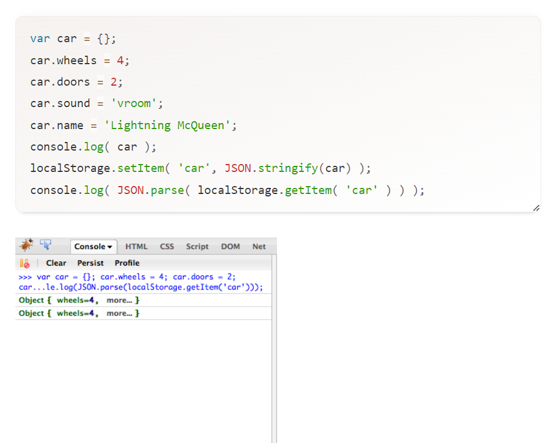

# Local Storage and How to Use it on Websites
Question and Answers courtesy of [SmashingMagazine.com](https://www.smashingmagazine.com/2010/10/local-storage-and-how-to-use-it/)

#### 1. Why would a developer use local storage for a web application?
- It improves the user experience by increasing performance while reducing server load.
- It allows users to have a more seamless experience, especially for websites that they frequently visit.

#### 2. What information should not be stored in local storage?
- Anything that is considered private/sensitive information (passwords, personally identifiable information(PII), credit card numbers, etc.).
- ChatGPT summarizes this fairly easily by stating, "Overall, it's essential to follow security best practices and only store necessary information in local storage. Avoid storing sensitive data or anything that could compromise the security and privacy of your application or its users."
  * [ChatGPT.com](https://chat.openai.com/share/b471eaa3-2295-4a29-a48b-be8d8246913a)

#### 3. Local storage can store what type of data? How would you convert it to that type before storing?
- Local storage can only store strings in the different keys. So, when referencing an object, it will not be stored the right way.
- A developer can get around this limitation by using the native `JSON.stringify()` and `JSON.parse()` methods (*see example below*).

  * Courtesy of: [SmashingMagazine.com](https://www.smashingmagazine.com/2010/10/local-storage-and-how-to-use-it/)

## Things I Want to Know More About
- [The Past, Present, and Future of Local Storage for Web Application](https://diveinto.html5doctor.com/storage.html)