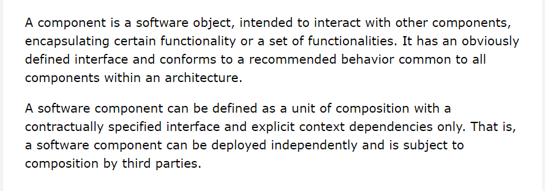
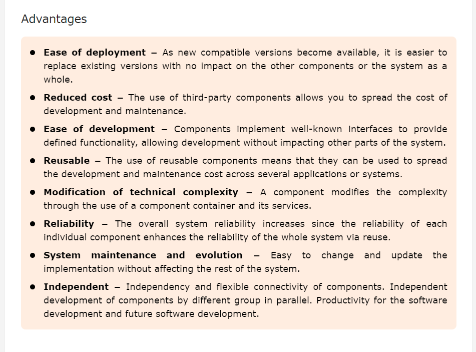

# Introduction to React and Components

### [Component-Based Architecture](https://www.tutorialspoint.com/software_architecture_design/component_based_architecture.htm)

#### 1. What is a "component"?
- "A component is a modular, portable, replaceable, and reusable set of well-defined functionality that encapsulates its implementation and exporting it as a higher-level interface." - Credit [tutorialspoint.com](https://www.tutorialspoint.com/software_architecture_design/component_based_architecture.htm)
- They also go on to further explain:

#### 2. What are the characteristics of a component?
- **Reusability**: Components are usually designed to be reused in different situations in different applications. However, some components may be designed for a specific task.
- **Replaceable**: Components may be freely substituted with other similar components.
- **Not context specific**: Components are designed to operate in different environments and contexts.
- **Extensible**: A component can be extended from existing components to provide new behavior.
- **Encapsulated**: A component depicts the interfaces, which allow the caller to use its functionality, and do not expose detaisl fo the internal pocesses or any internal variables or states.
- **Independent**: Components are designed to have minimal dependencies on other components.

#### 3. What are the advantages of using component-based architecture?

### [What is Props and how to use it in React](https://www.freecodecamp.org/news/how-to-use-props-in-reactjs/)

#### 1. What is “props” short for?
- Properties

#### 2. How are props used in React?
- Props are passed into a component similar to how attributes work in HTML elements.
- When sending props (which are also properties and can be likened to attributes), you attach your values to them.
- There is a slight difference between writing HTML attributes and passing in props. HTML attributes are special keywords already provided to the developer. In React, a developer can customize and define their own props.

#### 3. What is the flow of props?
- Since React uses a one-way data flow, any data that is transferred can only be from the parent component to the child components.
- Data flow will NEVER be passed from child components to parent components.
- Note: data passed from the parent CANNOT be changed by the child component.

## Things I Need to Know More About
- [React Tutorial through ‘Passing Data Through Props’](https://react.dev/learn/tutorial-tic-tac-toe)
- [React Docs - Hello world](https://legacy.reactjs.org/docs/hello-world.html)
- [React Docs - Introducing JSX](https://legacy.reactjs.org/docs/introducing-jsx.html)
- [React Docs - Rendering elements](https://legacy.reactjs.org/docs/rendering-elements.html)
- [React Docs - Components and props](https://legacy.reactjs.org/docs/components-and-props.html)
